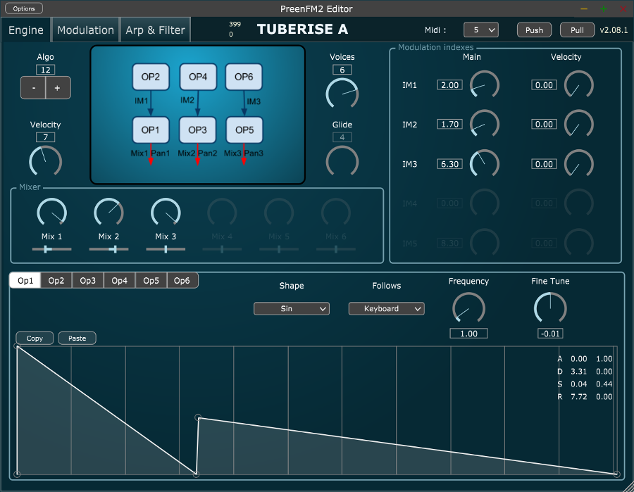
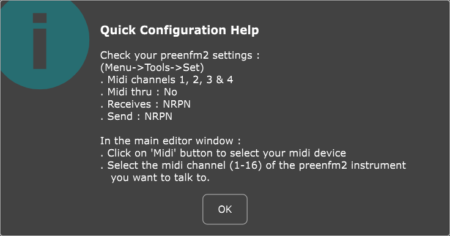

# preenfm software editor

Here is the source code of the software editor for the preenfm2 and preenfm3.  
It's using the very nice [JUCE library](https://www.juce.com/discover).

 

 

There are compiled versions for macOS and Windows [here](https://github.com/Ixox/preenfm2Controller/releases).

To start, follow these steps : 

 

 

If you have any questions or suggestions, please use the preenfm forum. 
This thread should be the one : http://ixox.fr/forum/index.php?topic=69349.0
