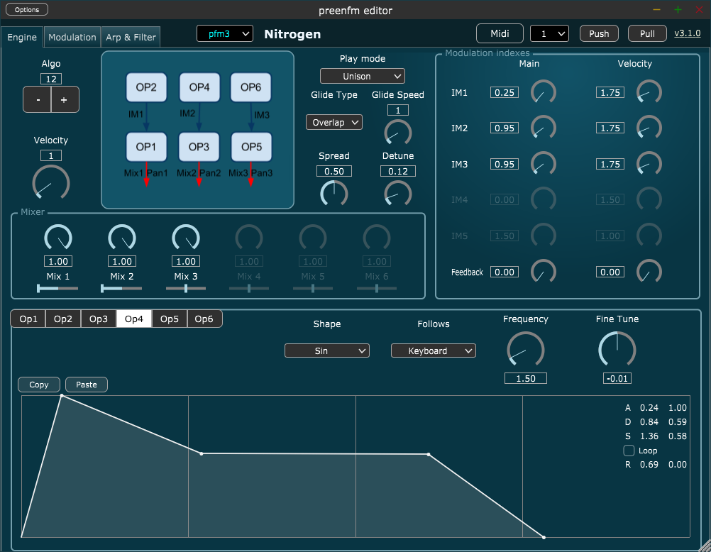
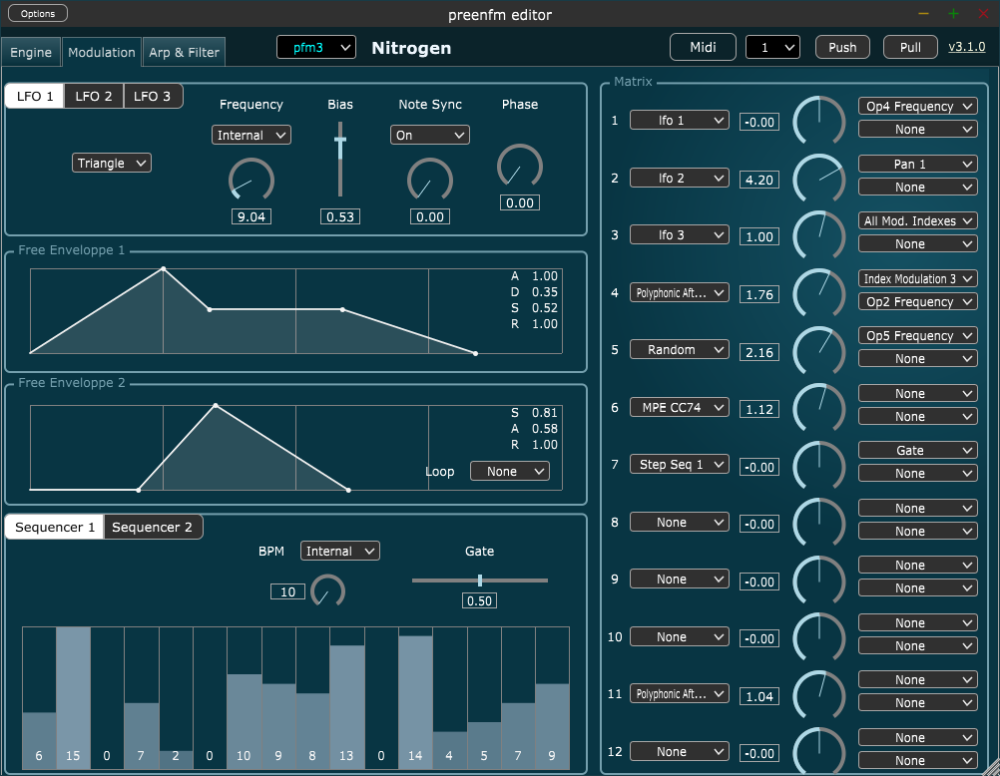
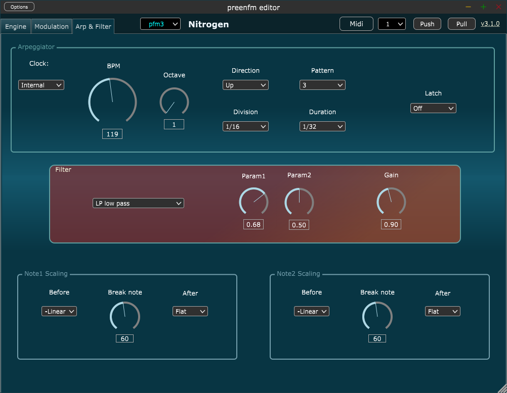
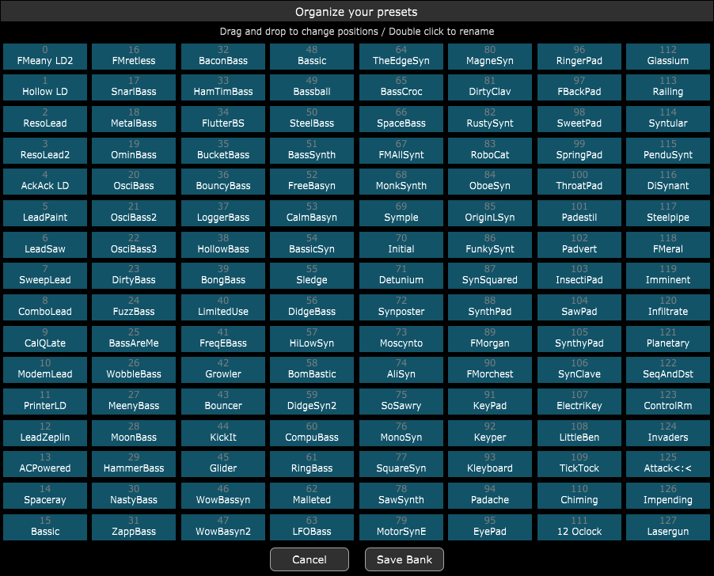

# preenfm software editor

You'll find here the source code of the software editor for the preenfm sound module (version 2 & 3).  
It's using the great [JUCE library](https://www.juce.com/discover).

There are compiled versions for macOS and Windows [here](https://github.com/Ixox/preenfm2Controller/releases).  

To start, follow these steps : 

 

 
 
If you have any questions or suggestions, please use the preenfm forum.  
This thread should be the one :   
http://ixox.fr/forum/index.php?topic=69349.0
 
 

# Screenshots

 

 
 

 
 

 
 

 
 
 

