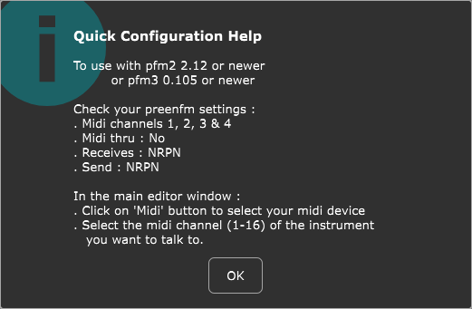

# preenfm2 software editor

Here is the source code of the software editor for the preenfm2.  
It's using the [JUCE library](https://www.juce.com/discover) in the current version.

 

 

There are compiled versions for macOS and windows [here](https://drive.google.com/drive/folders/0B7fPjBEexfCBWVR6U09NOGZTWTg?usp=sharing).

To start, follow these steps : 

 

 

If you have any questions or suggestions, please use the preenfm2 forum. 
This thread should be the one : http://ixox.fr/forum/index.php?topic=69349.0
